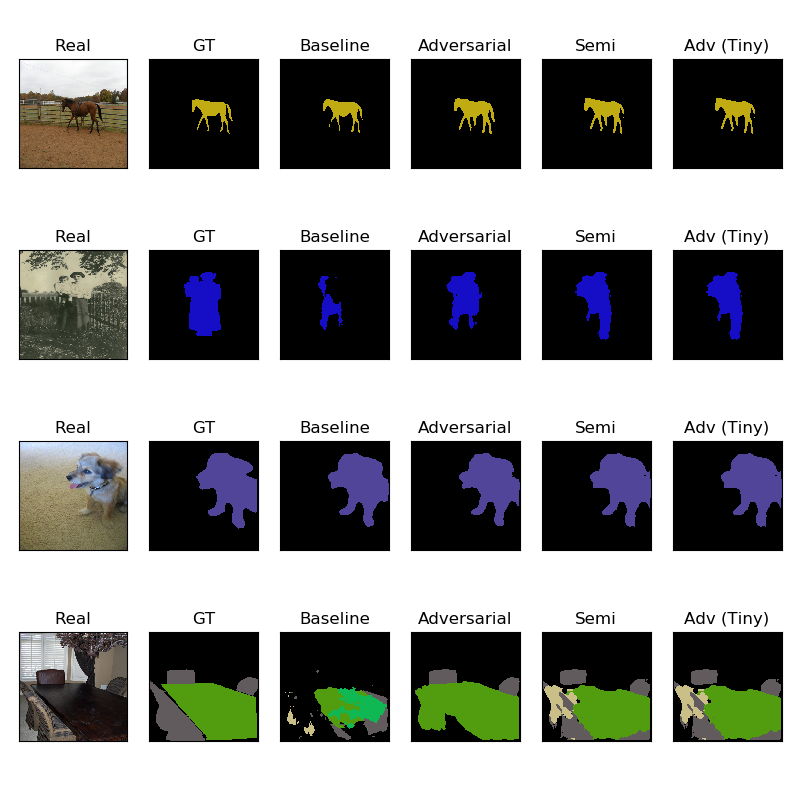

## Adversarial Learning for Semi-Supervised Semantic Segmentation

This project is an unofficial implementation of [Adversarial Learning for Semi-Supervised Semantic Segmentation](https://arxiv.org/abs/1802.07934) written with tensorflow and keras.

### Differences From The Paper

I tried to replicate the paper exactly, however some of the things may not be the same with the [original implementation](https://github.com/hfslyc/AdvSemiSeg). Below are some of them. 

* **Training dataset**: I made my experiments with augmented PASVAL VOC dataset which contains around 8 thousand images, the original paper uses around 11 thousand images.

* **Training Schedule**: The paper did not use adversarial loss immediately after the training starts, it waits for a while until generator learns something. Since I used a generator which is trained on the same dataset, I started to train both models at the same time. 

* **LR decay**: The paper uses polynomial decay for the learning rate. I tried to implement it for baseline model yet the results are not as good as using reducing learning rate by 0.5 when validation loss did not improve over n epochs. 

* **Number of iterations**: I trained all models untill validation loss did not improve after a point. The paper uses a fixed number of iterations.

### Results
I optained below results in terms of MIOU.

| Model | MIOU  |
| ----- | ----- |
| Baseline (DeeplabV3) | 0.68 |
| Baseline + Adv Loss | 0.72 |
| Baseline (1/2 Data) + Adv Loss + Semi Loss | 0.71 |

And some visual examples

### Notebooks
I made my experiments on Google Colab and put each notebooks I have written.

* [Baseline Notebook](Adverseg_Baseline.ipynb): Notebook that trains baseline model

* [Model with Adversarial Model](AdverSeg_Adversarial.ipynb): Training notebook of adversarial model with full data. 

* [Model with Semi Supervised Learning](AdverSeg_Semi.ipynb): Training notebook with unlabeled data.

### Training Your Own Dataset

If you want to use another data, you should modify `load_mask`, `load_img` and `mask_name_to_img_name` functions in the [file_utils script](file_utils.py) according to your data. Also, you should modify the image and masks reading logic in the [VOCGen.py script](VOCGen.py).

Other than these, you may need to change the discriminator or generator model according to your data.

## Sources

* [Paper](https://arxiv.org/abs/1802.07934)
* [Original Implementation](https://github.com/hfslyc/AdvSemiSeg)
* [DeepLabV3 implementation](https://github.com/bonlime/keras-deeplab-v3-plus)
* [mIOU implementation](https://gist.github.com/Kautenja/69d306c587ccdf464c45d28c1545e580)